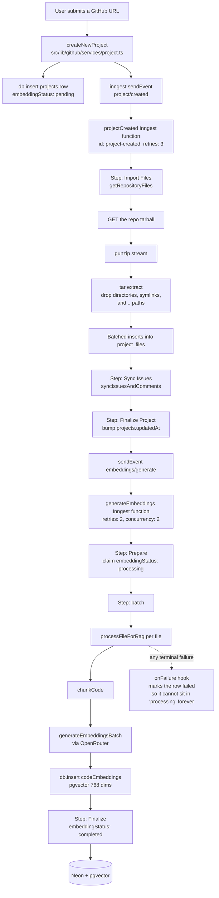
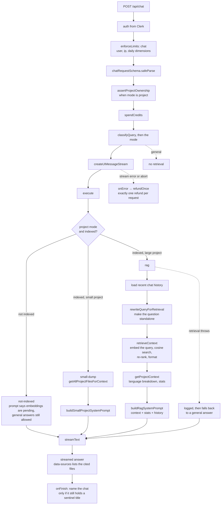

# Architecture

This document describes how the code is arranged, how the two long-running flows
work, and — the part that matters most for anyone changing this codebase — the
three structural tensions the current design carries. Every claim here was
checked against the code; where the code and the comments disagree, the code
wins and the disagreement is called out.

It is a map, not a rulebook. The comment on the function is closer to the
truth than anything written at this distance.

## Layering

```
app/                 Next.js App Router: pages, route handlers, proxy
db/                  Drizzle schema + SQL migrations
src/features/        Vertical slices: auth, chat, dashboard, landing, projects, rag
src/lib/             Cross-cutting services: trpc, inngest, github, llm, credits,
                     rate-limit, logger, guards, health, validation
src/shared/          Reusable UI (components), hooks, and cross-feature helpers
```

The dependency direction is one-way in principle: `app` → `features` → `lib` →
`db`. `db` imports nothing from `src`, and `src/shared` imports nothing from
`src/features`, both verified.

`src/lib` is the layer where the rule bends, in four places, and they are worth
knowing because each one is a deliberate exception rather than an oversight:

| Import | Why it exists |
|---|---|
| `src/lib/trpc/routers/_app.ts` → the chat and dashboard routers | It is the composition root. A registry that does not reference the routers it registers cannot register them. |
| `src/lib/inngest/functions.ts` → `processFileForRag` | The background worker is the only thing that calls the ingestion pipeline, and the pipeline is genuinely part of what this app is. |
| `src/lib/github/services/files.ts` → `computeHash` | Tarball ingestion needs the same content hash the RAG chunker uses, so importing the one implementation beats duplicating it. |

So: a `lib` file that reaches into a feature slice should be one of those
three shapes — a registry, a worker entry point, or a shared pure function.
A fourth kind, a service quietly importing a slice's internals to reuse
business logic, is a cycle in the making.

A slice should reach for shared code rather than another slice's internals;
where one slice does import another's internals, that is the exception to look
for in review, not the pattern to copy.

| Directory | Owns | Does not own |
|---|---|---|
| `app/` | HTTP concerns: auth gate, request parsing, status codes, streaming | business rules, SQL |
| `db/` | Table definitions and migrations. Nothing else | queries, HTTP, business rules |
| `src/features/*` | A user-facing capability end to end — UI, hooks, tRPC procedures, service layer | cross-cutting infrastructure |
| `src/lib/` | One concern per file, usable by any slice | UI |
| `src/shared/` | Presentational components and pure helpers | data access, side effects |

### `src/lib/github` is a module with one door

Everything that talks to GitHub — Octokit, axios, retry policy, rate-limit
handling, error taxonomy — lives under `src/lib/github/`. The barrel
`src/lib/github/index.ts` is the only intended entry point. It exports the
service functions (`createNewProject`, `getRepositoryFiles`, `getCommitHashes`,
`getAiSummaryOfCommit`, `syncIssuesAndComments`) and the error classes
(`GitHubError`, `GitHubAPIError`, `GitHubRateLimitError`, `GitHubNotFoundError`,
`GitHubValidationError`). It deliberately does **not** export the `octokit`
singleton, `constants.ts`, or `utils.ts`.

The reason is that a feature slice should never be able to make its own GitHub
call. Rate limiting, retry, and the error taxonomy are the whole point of the
module; a slice that constructs its own client gets none of them, and the
`GITHUB_TOKEN` is a single process-wide credential that must not be handled in
feature code.

**This rule is convention, not enforcement.** `eslint.config.mjs` contains no
`no-restricted-imports` rule, so nothing mechanically stops a file in
`src/features/` from importing `@/src/lib/github/client`. The boundary is real
in review and aspirational in the toolchain. Adding the import rule is a small
change with real value; it is not done here because the task that asked for
this document was scoped to documentation.

## The two flows

### Ingestion: a repository becomes searchable

Triggered by `createNewProject`, which sends a `project/created` event. All of
it runs in Inngest functions rather than in the request, so a slow or failing
import never blocks the user who created the project.



Two properties are worth knowing before you touch this path:

- **The tarball stream is the part that used to kill the process.** A corrupt
  or truncated response made the gunzip stream emit `error` with no listener,
  which is an uncaught exception in Node. The Inngest run then neither failed
  nor retried, and the project sat at some fraction of its files. It is handled
  now, and reported as an error rather than dropped.
- **`createNewProject` is not atomic.** See tension #1.

### Chat: a question becomes a grounded answer

`POST /api/chat` is a route handler rather than a tRPC procedure because the
response is a stream, not a payload. It meters, charges, retrieves, and streams
in that order, and a failure at any point after the charge is refunded exactly
once.



The retrieval branch is chosen per request, not configured per project, because
it depends on data that changes: a project that was small enough to dump
yesterday may have grown, and a project whose embedding job is still running
cannot be searched at all. `isSmallProject(estimatedTokens)` is the switch.

The `files` cited in the answer are the `relatedFiles` the retrieval path
returns, so the citations a user sees are exactly the chunks the model was
given — not a separately-computed guess.

## The three structural tensions

These are not bugs. Each is a live trade-off, and each would be a reasonable
choice to revisit given a different constraint.

### 1. No transactions

`db` is `drizzle-orm/neon-http` against Neon. The HTTP driver has no
transaction support, and the project's recorded decision is to stay on it.
There is no `db.transaction()` call anywhere in the codebase.

The cost is that any multi-write sequence can be interrupted between statements.
`createNewProject` writes a project row, then commits, then issues and
comments, as independent statements. A failure halfway leaves the project row
present with partial history. The header on that function says so, and the
recovery path is a re-sync, which is idempotent. Nothing sweeps up after it:
`cleanupStaleData` purges expired rate-limit rows and nothing else, so a
half-imported project stays half-imported until someone re-syncs it.

What this buys: the driver is stateless, so it works unchanged across
serverless instances with no connection pool to manage. A transaction would have
required the WebSocket driver and a pool.

### 2. Tenant isolation is application-level, with no RLS

There is no row-level security. No migration enables it and no policy exists.
Every query that touches user data must filter by owner in the query itself.

This is why `assertProjectOwnership` and `verifyOwnership` are not boilerplate
— they are the only thing standing between a missing `where` clause and a
cross-tenant read. Both fold ownership into the same statement as the lookup
rather than checking separately, so "no such project" and "someone else's
project" produce the same failure and cannot be told apart by an attacker.

The trade-off: the database will happily return another tenant's rows to a
query that forgets. Postgres row-level security would make that impossible even
for a query written in a hurry. It costs a session variable per request, an
`ALTER TABLE ... ENABLE ROW LEVEL SECURITY` per table, and a policy per
access pattern.

### 3. Two ownership primitives

There are two, and they are not interchangeable:

| | `assertProjectOwnership` | `projectService.verifyOwnership` |
|---|---|---|
| Lives in | `src/lib/guards.ts` | the dashboard `projectService` |
| Returns | the project row | nothing |
| Throws | `ProjectAccessError` | `TRPCError` NOT_FOUND |
| Used by | route handlers, the chat router | the dashboard service's own methods |

Both filter by `ownerId`, so neither is a security hole. The cost is
consistency: error shape and return value differ depending on which one a
procedure happens to use, and a reader has to know which is in scope before
they can predict what a failed check looks like. The tension is that the shared
guard exists precisely so there is one place to look, and the dashboard service
not using it means there are two.

There is a fix for this tension in flight under task T-037: make
`ProjectAccessError` extend `TRPCError` with code NOT_FOUND, then delete
`verifyOwnership` and point its eight call sites at the guard. If you read this
section after that lands, there is one primitive and this table is history.

## What is deliberately absent

- **No Caching layer.** The dashboard makes one batched round-trip rather than
  seven, and the numbers in the code comment are measured, not assumed. Caching
  was not added because a stale dashboard is a confusing dashboard.
- **No message queue beyond Inngest.** Ingestion and embedding are the only
  genuinely long-running work, and Inngest covers them with retries and
  per-function concurrency.
- **No data export or soft delete.** Account deletion is a hard cascade; there
  is no grace period and no self-serve export. Both are known gaps, tracked
  separately.
